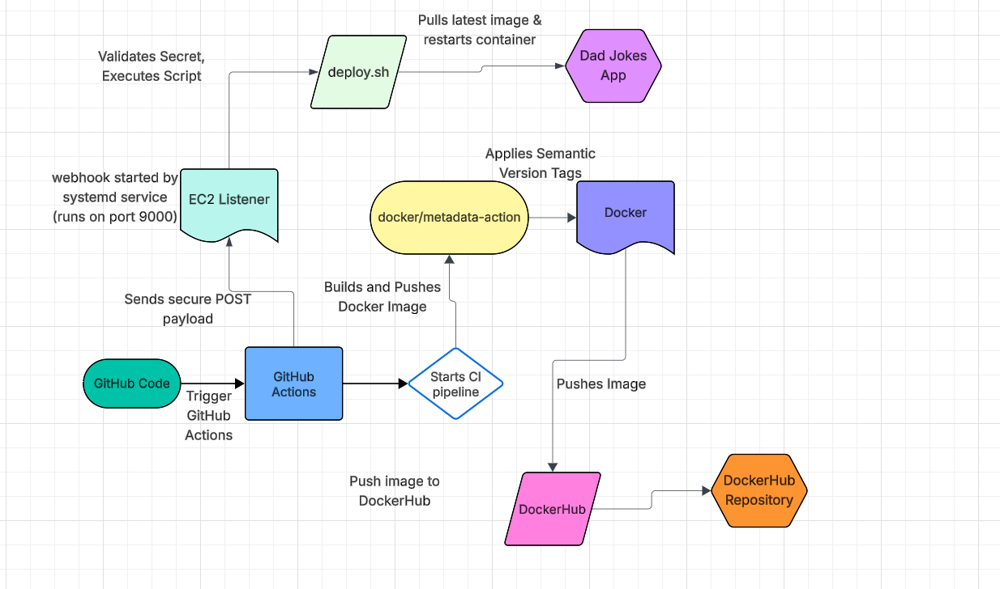

# Project 5
Jacob Wing, wing.10@wright.edu

# AI Generation Notice
This project uses two html files and a css file under the directory ./web-content created by **ChatGPT**

## Prompt used:
"Create a dad joke themed website with a minimum of two HTML files and one CSS file."

# Continuous Deployment Project Overview
This project implements a continuous deployment pipeline that automatically refreshes the running
 application on an EC2 instance when a new Docker image is pushed by the CI workflow. After GitHub
 Actions finishes building and pushing the image to DockerHub, it sends a secured webhook payload
 to the EC2 server. The webhook listener validates the request and executes the deployment script,
 replacing the old container with the new container.

# Goal of the Project
The goal of the project is to automate the deployment process so that the application hosted on the EC2
instance always runs the latest Docker image. This elimates the need for manual pulls and establishes
a fully automated CI/CD pipeline that responds to updates.

# Tools Used
- Docker
  - Runs the Dad Joke Central web application inside a container on EC2.
- DockerHub
  - Stores the built images and receives updated versions from GitHub Actions.
- GitHub Actions
  - Automates the build and push process and sends a webhook payload to the EC2 server after a successful build.
- adnanh/webhook
  - Listens for incoming POST requests and securely triggers the deployment script.
- systemd
  - Keeps the webhook service running automatically on boot and restarts it if it fails.
- EC2 Instance
  - Hosts the production environment and runs the updated container.

# Project Diagram
Created using LucidCharts The diagram below shows the CD/CI pipeline used in this project.



# Part One
## Instance Details
### AMI Information
- Operating System: Amazon Linux 2023
- AMI Type: HVM (Hardware virtual machine)
- Default SSH User: ec2-user
### Instance Type
- t.2 medium
  - 2 vCPUs
  - 4 GB RAM
### Volume Size
- 30 GB (gp3)
## Security Group Config
### Inbound
- SSH, TCP, Port:22, Source:98.29.131.39/32, Home Access
  - Locked for not trusted users
- SSH, TCP, Port:22, Source:134.48.0.0/16 WSU access
  - Locked for not trusted users
- HTTP, TCP, Port:80, Source:0.0.0.0/0, Public website access
  - Allows users to access the website
- Custom TCP, TCP, Port:9000, Source:0.0.0.0/0, Webhook listener
  - Open to allow webhook messages for deployment
### Outbound
- All traffic, All, Port:All, Destination: 0.0.0.0/0, Outbound traffic
  - Allows docker pulls, package installs, webhook replies
## Docker Setup
### Installing Docker
On Amazon Linux 2023:
```
sudo dnf update -y
sudo dnf install -y docker
sudo systemctl start docker
sudo systemctl enable docker
sudo usermod -aG docker ec2-user
newgrp docker
```
### Additional Dependencies
- None are required beyond Docker

### Confirm Docker Works
On Amazon Linux 2023:
`docker run hello-world`
Runs hello-world image built from the web

## Testing on EC2 Instance
### Pull Container
`docker pull jawing641/dadjokes:latest`

### Run Container from Image
```
docker run -d \
  --name dadjokes \
  --restart unless-stopped \
  -p 80:80 \
  jawing641/dadjokes:latest
```
Runs the image on port 80, receiving on port 80.
- "-it" loads an interactive terminal session
- "-d" uses detached mode (background)

### Verify Image Runs

Check container status: `docker ps`
Open a browser and visit `http://(EC2-PUBLIC-IP)`

## Bash Refresh Script

- Description: The deploy.sh script automates refreshing the running container on the EC2 instance.
  - Stops any existing container named dadjokes
  - Removes old dadjokes container
  - Pulls latest version of the image from DockerHub
  - Runs a new container in detached mode on port 80 with automatic restart policy.
- How to test:
  - SSH into EC2 instance as ec2-user
  - confirm container runs: `docker ps`
  - On a browser, visit `http://(EC2-PUBLIC-IP`
- Link: https://github.com/WSU-kduncan/cicdf25-Jakethesnake641/blob/main/deployment/deploy.sh
## Part One Resources

- Link: https://docs.docker.com/reference/cli/docker/container/stop/
- Usage: Used to safely stop the running container before removal.

- Link: https://docs.docker.com/reference/cli/docker/container/rm/
- Usage: Used to remove the old container before starting a new one.

- Link: https://docs.docker.com/reference/cli/docker/container/run/
- Usage: Used to start the refreshed container with port mapping and restart policy.

- Link: https://docs.docker.com/reference/cli/docker/image/pull/
- Usage: Used to download the newest container image version from DockerHub.

- Link: https://docs.docker.com/engine/containers/start-containers-automatically/
- Usage: Used to configure --restart unless-stopped so the container resumes after reboot.

- Link: https://www.gnu.org/software/bash/manual/html_node/The-Set-Builtin.html
- Usage: Used to stop script execution if a command fails.

- Link: https://www.gnu.org/software/bash/manual/bash.html#Shell-Scripts
- Usage: Used to understand how Bash shell scripts execute commands sequentially, handle permissions, and automate tasks.

# Part Two
## Configuring Webhook
### Install adnanh's webhook 
```
cd ~
curl -L -o webhook.tar.gz https://github.com/adnanh/webhook/releases/latest/download/webhook-linux-amd64.tar.gz
tar -xzf webhook.tar.gz
sudo mv webhook-linux-amd64/webhook /usr/local/bin/webhook
sudo chmod +x /usr/local/bin/webhook
```
### Verify Installation
`webhook -version`
- If it prints a string, it's good to go

### Summary of webhook file
- The webhook file contains a single hook that:
  - Listens on the path /hooks/dadjokes-deploy
  - Validates a shared secret in the HTTP header
  - Runs the deploy.sh script in the deployment folder when the secret matches.
### Verify Webhook Receives Payloads
- Make sure webhook is running
- Send a Post request from another machine
```
curl -X POST \
  -H "X-Webhook-Token: SUPERSECRET123" \
  http://(EC2-PUBLIC-IP):9000/hooks/dadjokes-deploy
```
- On the EC2 instance, check the webhook logs and Docker status
```
journalctl -u webhook -f    # watch logs
docker ps                   # confirm dadjokes container is running
```
### Monitoring logs from Webhook
- Logs can be viewed with: `journalctl -u webhook`
### What to look for in Docker Process Views
- A container named dadjokes is running
- It is using the latest image tag from DockerHub
- It is bound to port 80
### Link to Definition File
- https://github.com/WSU-kduncan/cicdf25-Jakethesnake641/blob/main/deployment/hooks.json
## Webhook Service on EC2 Instance
### Summary of webhook
- A systemd service was created so the webhook listener starts automatically when the EC2 boots up
  and restarts on failure.
### Enable and Start Webhook Service
```
sudo systemctl daemon-reload
sudo systemctl enable webhook
sudo systemctl start webhook
sudo systemctl status webhook
```
### Verify Service is capturing Payloads
- Watch logs when running: `journalctl -u webhook -f`
- From another client send: 
```
curl -X POST \
  -H "X-Webhook-Token: SUPERSECRET123" \
  http://<EC2-PUBLIC-IP>:9000/hooks/dadjokes-deploy
```
- You should see:
  - Incoming request
  - Hook Match
  - Execution of /home/ec2-user/deployment/deployment.sh
- Confirm with: `docker ps`
### Link to Service File
- https://github.com/WSU-kduncan/cicdf25-Jakethesnake641/blob/main/deployment/webhook.service
## Part Two Sources
- Link: https://github.com/adnanh/webhook
- Usage: Used as the webhook listener service on the EC2 instance to receive HTTP POST payloads and trigger the deploy.sh refresh script.

- Link: https://github.com/adnanh/webhook/releases
- Usage: Used to download and install the webhook binary on Amazon Linux EC2.

- Link: https://github.com/adnanh/webhook/blob/master/docs/Hook-Definition.md
- Usage: Used to define the hooks.json file structure, including id, execute-command, working directory, and trigger rules.

- Link: https://www.digitalocean.com/community/tutorials/understanding-systemd-units-and-unit-files
- Usage: Used to understand [Unit], [Service], and [Install] sections of the webhook service file.

- Link: https://docs.redhat.com/en/documentation/red_hat_enterprise_linux/8/html/configuring_basic_system_settings/viewing-and-managing-log-files_configuring-basic-system-settings
- Usage: Used to manually test webhook payload delivery using curl -X POST.

- Link: https://docs.docker.com/reference/cli/docker/container/ls/
- Usage: Used to verify that the refreshed dadjokes container is running after a webhook trigger.

- Link: https://docs.docker.com/engine/containers/start-containers-automatically/
- Usage: Used to configure --restart unless-stopped so the container survives EC2 reboots.

- Link: https://docs.aws.amazon.com/AWSEC2/latest/UserGuide/ec2-security-groups.html
- Usage: Used to configure TCP port 9000 for webhook listener traffic and port 80 for HTTP

- Link: https://github.com/adnanh/webhook/tree/master/docs
- Usage: Used to define trigger rules in hooks.json, including matching incoming HTTP headers such as X-Webhook-Token for secure webhook validation.

- Link: https://www.digitalocean.com/community/tutorials/how-to-use-journalctl-to-view-and-manipulate-systemd-logs
- Usage: Used to monitor the webhook systemd service logs using journalctl -u webhook and journalctl -u webhook -f.

# Part Three
## Configuring a Payload Sender
### Justification for Selecting GitHub
- GitHub Actions is responsible for building and pushing new Docker images. Using GitHub as the sender
ensures that the EC2 listener only runs the deployment script after the CI build successfully completes.
### How to enable GitHub to send payloads to EC2 webhook listener
When CI finishes and the container image is pushed to DockerHub, GitHub calls the webhook running on the
EC2 instance
```
- name: Notify EC2 Webhook Listener
  run: |
    curl -X POST \
    -H "X-Webhook-Token: SUPERSECRET123" \
    http://<EC2-PUBLIC-IP>:9000/hooks/dadjokes-deploy
```

### What triggers will send a payload to EC2 webhook listener?
- A payload is sent when
  - Semantic tag is pushed to GitHub
  - GitHub Actions builds and pushes Docker image to DockerHub
  - After the push, GitHub sends the payload to the EC2 webhook.
### How to verify a successful payload delivery
- `journalctl -u webhook -f` shows:
  - Incoming request
  - Matched hook
  - Execution of deploy.sh
### How to validate webhook only triggers when requests are coming from GitHub
- The webhook definition includes a trigger that checks for custom header
  - Only GitHub actions contains this secret header
  - Requests without header are ignored.
## Resources
- Link:https://github.com/adnanh/webhook/releases
- Usage: Used to install and run the webhook binary on the EC2 instance so it can listen on port 9000 for HTTP POST requests and trigger the deploy.sh script when a valid payload is received.

- Link: https://github.com/adnanh/webhook/tree/master/docs
- Usage: Used to configure the hooks.json file, including the id, execute-command, command-working-directory and trigger-rule sections that check the X-Webhook-Token header before running the deployment script.

- Link: https://docs.github.com/en/actions
- Usage: Used to configure the CI workflow that builds and pushes the Docker image and to add an extra step that sends a curl POST request to the EC2 webhook listener after a successful image push.

- Link: https://docs.github.com/en/webhooks/about-webhooks
- Usage: Used to understand how webhooks are used to notify external services when repository events occur and to design the overall flow where GitHub notifies the EC2 server after CI/CD completes.

- Link: https://docs.docker.com/docker-hub/repos/manage/webhooks/
- Usage: Used as a reference for an alternative design where DockerHub could send webhooks directly when new images are pushed and to compare this option against using GitHub Actions as the payload sender.

